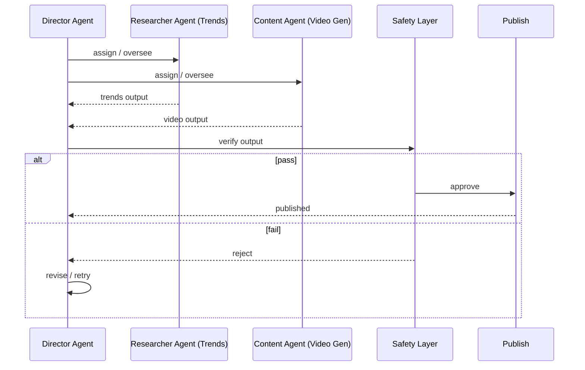

# Hierarchical Agent Swarm

Director Agent oversees a Researcher Agent (Trends) and a Content Agent (Video Gen), and verifies output against a Safety Layer before publishing.

## Architecture (flowchart)

```mermaid
flowchart TB
    subgraph Director["Director Agent"]
        D[Director]
    end

    subgraph Agents["Specialist Agents"]
        R[Researcher Agent\n(Trends)]
        C[Content Agent\n(Video Gen)]
    end

    subgraph Safety["Safety & Publish"]
        SL[Safety Layer]
        P[Publish]
    end

    D -->|delegates / oversees| R
    D -->|delegates / oversees| C
    R -->|output| D
    C -->|output| D
    D -->|verifies against| SL
    SL -->|pass| P
    SL -.->|fail| D

    style Director fill:#e1f5fe
    style Agents fill:#f3e5f5
    style Safety fill:#e8f5e9
    style D fill:#0288d1,color:#fff
    style SL fill:#2e7d32,color:#fff
    style P fill:#388e3c,color:#fff
```

## Verification flow (sequence)



## Diagram files

- **Flowchart (standalone):** `hierarchical-agent-swarm.mmd` — use in Mermaid Live Editor or CLI.
- **Markdown:** this file — renders in GitHub, GitLab, and editors with Mermaid support.
