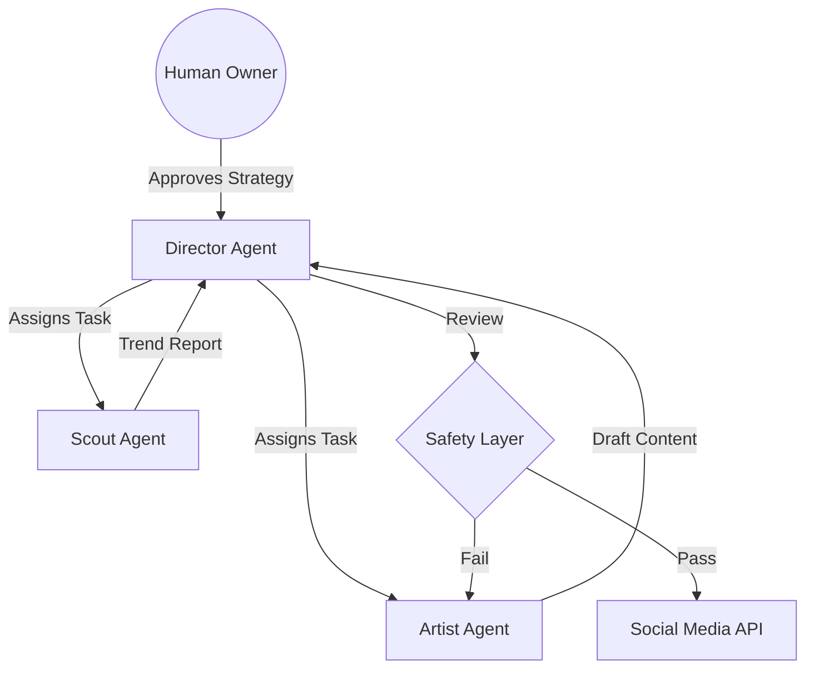

# Chimera Architecture Strategy

## Selected Pattern: Hierarchical Swarm
We are utilizing a **Manager-Worker** topology.
1. **Director (Orchestrator):** Holds the state, manages the schedule, and approves content.
2. **Scout (Research):** Scrapes OpenClaw/Twitter/Google Trends.
3. **Artist (Content):** Generates scripts and media assets.

## Social Protocol (OpenClaw)
Chimera will broadcast its `agent_status` (IDLE/BUSY) via the OpenClaw standardized heartbeat protocol to allow for cross-agent collaboration.

## Diagram
